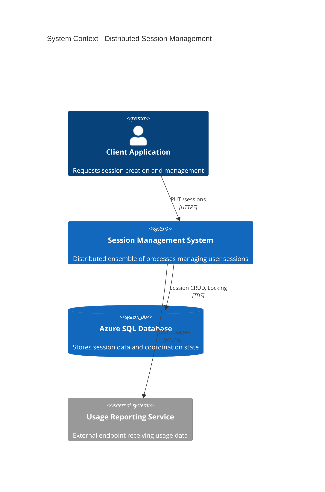
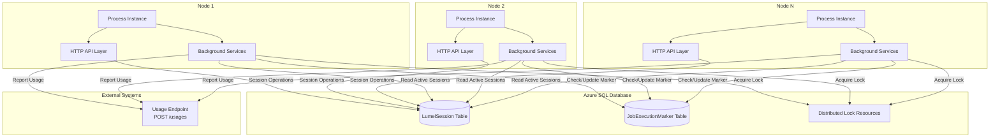
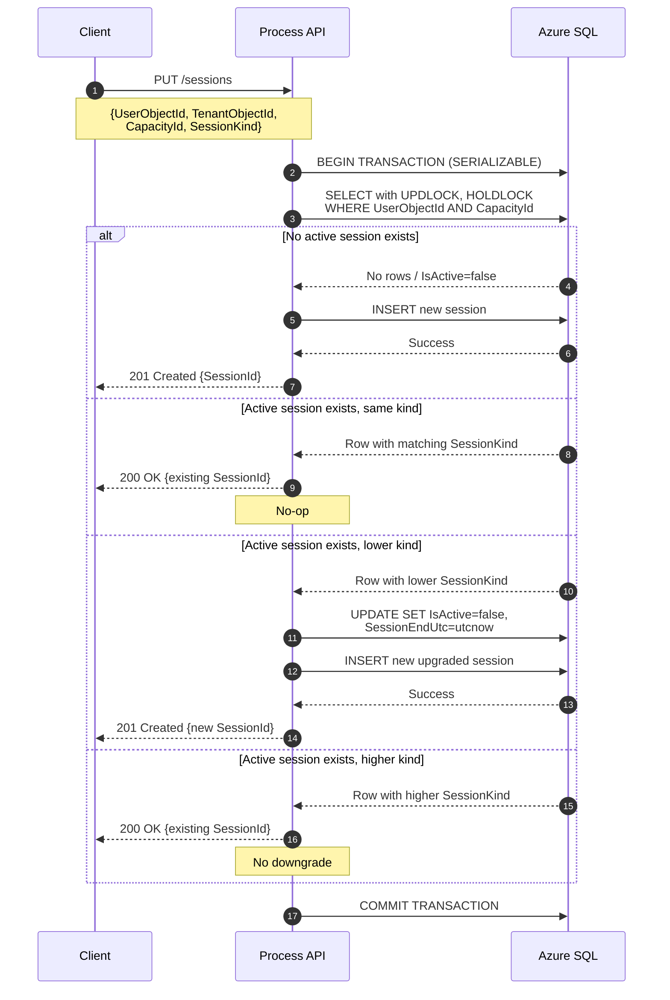
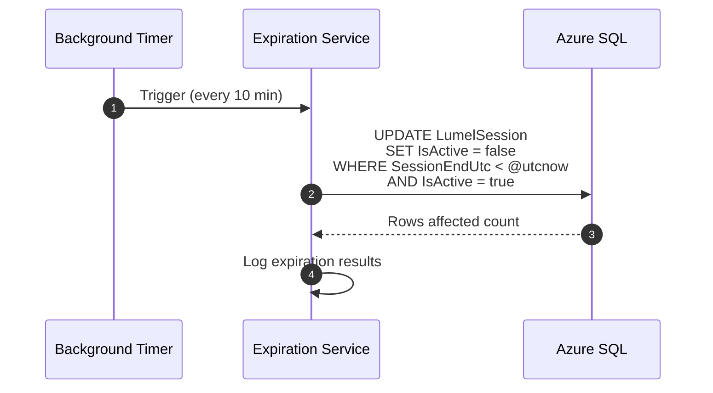
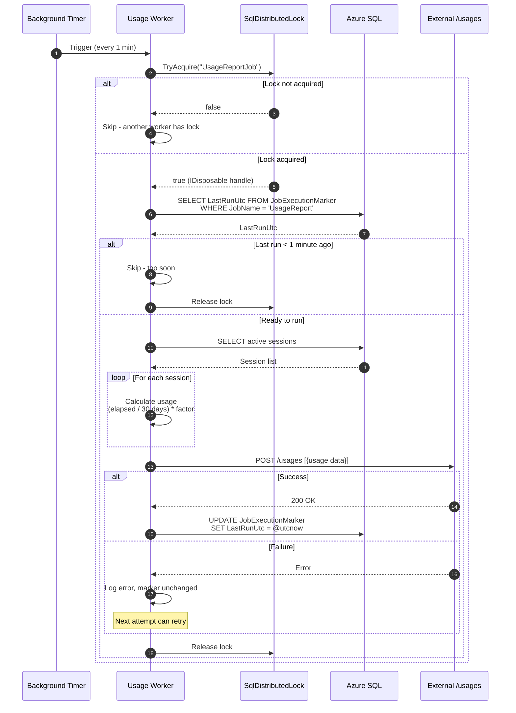
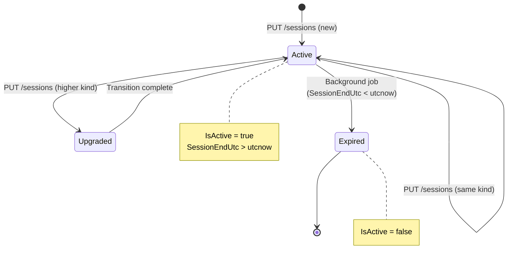
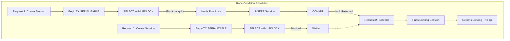
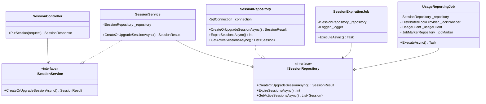
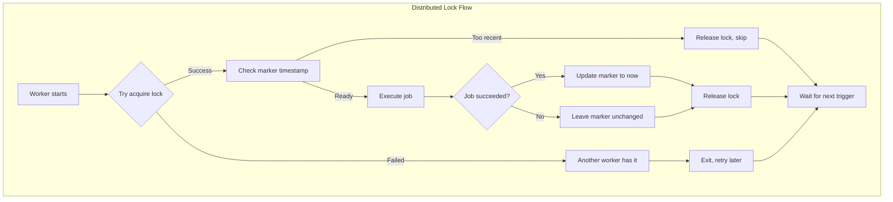
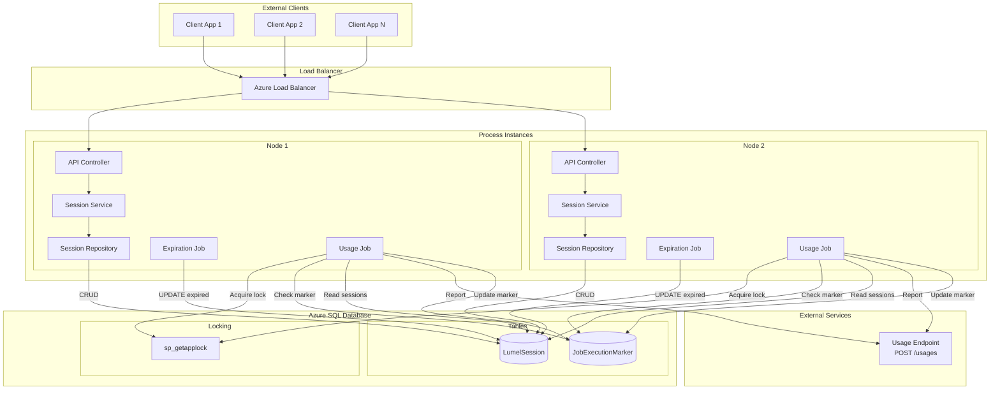

# Distributed Session Management System

## Architecture Document

**Version:** 1.0  
**Date:** December 22nd, 2025  
**Author:** Cristian Petculescu (cristp@microsoft.com)

---

## Table of Contents

1. [Executive Summary](#1-executive-summary)
2. [System Overview](#2-system-overview)
3. [Architecture Diagrams](#3-architecture-diagrams)
4. [Database Design](#4-database-design)
5. [API Specification](#5-api-specification)
6. [Core Components](#6-core-components)
7. [Background Jobs](#7-background-jobs)
8. [Distributed Coordination](#8-distributed-coordination)
9. [Pseudocode and Implementation](#9-pseudocode-and-implementation)
10. [Error Handling and Edge Cases](#10-error-handling-and-edge-cases)
11. [Deployment Considerations](#11-deployment-considerations)

---

## 1. Executive Summary

This document describes the architecture for a distributed session management system. The system runs as an ensemble of identical processes across multiple nodes, with no direct knowledge of each other. Coordination is achieved through SQL Server-based distributed locking and atomic database operations.

**Key Characteristics:**

- Idempotent session creation via `PUT /sessions`
- SQL-based serialization for concurrent session requests
- Exactly-once semantics for usage reporting via distributed locks
- Session lifecycle management with automatic expiration
- Session upgrade semantics based on session kind hierarchy

---

## 2. System Overview

### 2.1 High-Level Architecture

The system consists of multiple identical process instances running on different nodes. Each process:

- Exposes an HTTP API for session management
- Runs background jobs for session expiration and usage reporting
- Coordinates with other instances via SQL Server locks

### 2.2 Key Concepts

| Concept | Description |
|---------|-------------|
| **Session** | A time-bounded association between a user and a capacity |
| **UserObjectId** | Globally unique identifier for a user |
| **TenantObjectId** | Identifier for the tenant |
| **CapacityId** | Identifier for the capacity resource |
| **SessionKind** | Hierarchy level (1, 2, or 3) determining session features |
| **Active Session** | A session where `IsActive = true` and `SessionEndUtc > utcnow` |

### 2.3 Session Kind Semantics

Session kinds form a hierarchy where higher values represent upgraded capabilities:

- **Kind 1:** Basic session
- **Kind 2:** Enhanced session  
- **Kind 3:** Premium session

A session can only be upgraded (Kind 1 → 2 → 3), never downgraded.

---

## 3. Architecture Diagrams

### 3.1 System Context Diagram



### 3.2 Component Architecture



### 3.3 Session Creation Flow



### 3.4 Session Expiration Flow



### 3.5 Usage Reporting Flow (Distributed)



### 3.6 State Machine - Session Lifecycle



### 3.7 Concurrency Control - Session Creation Race Condition



---

## 4. Database Design

### 4.1 Schema Definition

```sql
-- Main session table
CREATE TABLE dbo.LumelSession (
    SessionId           UNIQUEIDENTIFIER    NOT NULL DEFAULT NEWSEQUENTIALID(),
    UserObjectId        UNIQUEIDENTIFIER    NOT NULL,
    TenantObjectId      UNIQUEIDENTIFIER    NOT NULL,
    CapacityId          UNIQUEIDENTIFIER    NOT NULL,
    SessionStartUtc     DATETIME2(7)        NOT NULL,
    SessionEndUtc       DATETIME2(7)        NOT NULL,
    SessionKind         TINYINT             NOT NULL,
    IsActive            BIT                 NOT NULL DEFAULT 1,
    CreatedUtc          DATETIME2(7)        NOT NULL DEFAULT SYSUTCDATETIME(),
    ModifiedUtc         DATETIME2(7)        NOT NULL DEFAULT SYSUTCDATETIME(),
    
    CONSTRAINT PK_LumelSession PRIMARY KEY CLUSTERED (SessionId),
    CONSTRAINT CK_SessionKind CHECK (SessionKind IN (1, 2, 3)),
    CONSTRAINT CK_SessionDates CHECK (SessionEndUtc > SessionStartUtc)
);

-- Index for fast lookup by user and capacity (the unique active session constraint)
CREATE UNIQUE NONCLUSTERED INDEX IX_LumelSession_ActiveUserCapacity
    ON dbo.LumelSession (UserObjectId, CapacityId)
    WHERE IsActive = 1;

-- Index for expiration job
CREATE NONCLUSTERED INDEX IX_LumelSession_Expiration
    ON dbo.LumelSession (SessionEndUtc, IsActive)
    WHERE IsActive = 1;

-- Index for usage reporting (active sessions)
CREATE NONCLUSTERED INDEX IX_LumelSession_ActiveSessions
    ON dbo.LumelSession (IsActive)
    INCLUDE (UserObjectId, TenantObjectId, CapacityId, SessionKind, SessionStartUtc)
    WHERE IsActive = 1;

-- Job execution marker table for exactly-once semantics
CREATE TABLE dbo.JobExecutionMarker (
    JobName             NVARCHAR(100)       NOT NULL,
    LastRunUtc          DATETIME2(7)        NULL,
    LastRunSuccessUtc   DATETIME2(7)        NULL,
    LastRunDurationMs   INT                 NULL,
    RunCount            BIGINT              NOT NULL DEFAULT 0,
    
    CONSTRAINT PK_JobExecutionMarker PRIMARY KEY CLUSTERED (JobName)
);

-- Initialize the usage report job marker
INSERT INTO dbo.JobExecutionMarker (JobName, LastRunUtc)
VALUES ('UsageReport', NULL);
```

### 4.2 Stored Procedures

```sql
-- Procedure for atomic session creation/upgrade
CREATE OR ALTER PROCEDURE dbo.usp_CreateOrUpgradeSession
    @UserObjectId       UNIQUEIDENTIFIER,
    @TenantObjectId     UNIQUEIDENTIFIER,
    @CapacityId         UNIQUEIDENTIFIER,
    @SessionKind        TINYINT,
    @SessionId          UNIQUEIDENTIFIER OUTPUT,
    @WasCreated         BIT OUTPUT,
    @WasUpgraded        BIT OUTPUT
AS
BEGIN
    SET NOCOUNT ON;
    SET XACT_ABORT ON;
    
    DECLARE @UtcNow DATETIME2(7) = SYSUTCDATETIME();
    DECLARE @SessionEndUtc DATETIME2(7) = DATEADD(DAY, 30, @UtcNow);
    DECLARE @ExistingSessionId UNIQUEIDENTIFIER;
    DECLARE @ExistingSessionKind TINYINT;
    
    SET @WasCreated = 0;
    SET @WasUpgraded = 0;
    
    BEGIN TRANSACTION;
    
    -- Lock the row for this user/capacity combination if it exists
    -- UPDLOCK + HOLDLOCK ensures serializable behavior for this specific row
    SELECT 
        @ExistingSessionId = SessionId,
        @ExistingSessionKind = SessionKind
    FROM dbo.LumelSession WITH (UPDLOCK, HOLDLOCK)
    WHERE UserObjectId = @UserObjectId 
      AND CapacityId = @CapacityId 
      AND IsActive = 1;
    
    IF @ExistingSessionId IS NULL
    BEGIN
        -- No active session exists - create new one
        SET @SessionId = NEWID();
        
        INSERT INTO dbo.LumelSession (
            SessionId, UserObjectId, TenantObjectId, CapacityId,
            SessionStartUtc, SessionEndUtc, SessionKind, IsActive
        )
        VALUES (
            @SessionId, @UserObjectId, @TenantObjectId, @CapacityId,
            @UtcNow, @SessionEndUtc, @SessionKind, 1
        );
        
        SET @WasCreated = 1;
    END
    ELSE IF @ExistingSessionKind < @SessionKind
    BEGIN
        -- Upgrade scenario: expire old session and create new one
        UPDATE dbo.LumelSession
        SET IsActive = 0,
            SessionEndUtc = @UtcNow,
            ModifiedUtc = @UtcNow
        WHERE SessionId = @ExistingSessionId;
        
        SET @SessionId = NEWID();
        
        INSERT INTO dbo.LumelSession (
            SessionId, UserObjectId, TenantObjectId, CapacityId,
            SessionStartUtc, SessionEndUtc, SessionKind, IsActive
        )
        VALUES (
            @SessionId, @UserObjectId, @TenantObjectId, @CapacityId,
            @UtcNow, @SessionEndUtc, @SessionKind, 1
        );
        
        SET @WasCreated = 1;
        SET @WasUpgraded = 1;
    END
    ELSE
    BEGIN
        -- Same or higher kind already exists - no-op
        SET @SessionId = @ExistingSessionId;
    END
    
    COMMIT TRANSACTION;
END;
GO

-- Procedure for session expiration
CREATE OR ALTER PROCEDURE dbo.usp_ExpireSessions
    @ExpiredCount INT OUTPUT
AS
BEGIN
    SET NOCOUNT ON;
    
    DECLARE @UtcNow DATETIME2(7) = SYSUTCDATETIME();
    
    UPDATE dbo.LumelSession
    SET IsActive = 0,
        ModifiedUtc = @UtcNow
    WHERE SessionEndUtc < @UtcNow
      AND IsActive = 1;
    
    SET @ExpiredCount = @@ROWCOUNT;
END;
GO

-- Procedure to get active sessions for usage reporting
CREATE OR ALTER PROCEDURE dbo.usp_GetActiveSessionsForUsage
AS
BEGIN
    SET NOCOUNT ON;
    
    SELECT 
        SessionId,
        UserObjectId,
        TenantObjectId,
        CapacityId,
        SessionKind,
        SessionStartUtc,
        SessionEndUtc
    FROM dbo.LumelSession
    WHERE IsActive = 1;
END;
GO

-- Procedure to check and update job marker
CREATE OR ALTER PROCEDURE dbo.usp_TryClaimUsageReportJob
    @MinIntervalMinutes INT = 1,
    @CanRun BIT OUTPUT,
    @LastRunUtc DATETIME2(7) OUTPUT
AS
BEGIN
    SET NOCOUNT ON;
    
    DECLARE @UtcNow DATETIME2(7) = SYSUTCDATETIME();
    SET @CanRun = 0;
    
    -- Get current marker with lock
    SELECT @LastRunUtc = LastRunUtc
    FROM dbo.JobExecutionMarker WITH (UPDLOCK)
    WHERE JobName = 'UsageReport';
    
    -- Check if enough time has passed
    IF @LastRunUtc IS NULL 
       OR DATEDIFF(MINUTE, @LastRunUtc, @UtcNow) >= @MinIntervalMinutes
    BEGIN
        SET @CanRun = 1;
    END
END;
GO

-- Procedure to mark job completion
CREATE OR ALTER PROCEDURE dbo.usp_MarkUsageReportComplete
    @DurationMs INT = NULL
AS
BEGIN
    SET NOCOUNT ON;
    
    UPDATE dbo.JobExecutionMarker
    SET LastRunUtc = SYSUTCDATETIME(),
        LastRunSuccessUtc = SYSUTCDATETIME(),
        LastRunDurationMs = @DurationMs,
        RunCount = RunCount + 1
    WHERE JobName = 'UsageReport';
END;
GO
```

---

## 5. API Specification

### 5.1 PUT /sessions

**Purpose:** Create a session for a user or return existing session (idempotent)

**Request:**

```json
{
    "userObjectId": "550e8400-e29b-41d4-a716-446655440000",
    "tenantObjectId": "6ba7b810-9dad-11d1-80b4-00c04fd430c8",
    "capacityId": "6ba7b811-9dad-11d1-80b4-00c04fd430c8",
    "sessionKind": 2
}
```

**Responses:**

| Status | Condition | Response Body |
|--------|-----------|---------------|
| 200 OK | Existing session returned (same or higher kind) | `{"sessionId": "...", "wasCreated": false}` |
| 201 Created | New session created | `{"sessionId": "...", "wasCreated": true, "wasUpgraded": false}` |
| 201 Created | Session upgraded | `{"sessionId": "...", "wasCreated": true, "wasUpgraded": true}` |
| 400 Bad Request | Invalid input | `{"error": "..."}` |

---

## 6. Core Components

### 6.1 Component Overview



---

## 7. Background Jobs

### 7.1 Session Expiration Job

**Frequency:** Every 10 minutes  
**Concurrency:** Safe to run on all nodes (idempotent UPDATE)

The expiration job marks sessions as inactive when their `SessionEndUtc` has passed. Since the UPDATE operation is idempotent (already-expired sessions have `IsActive = false`), multiple nodes can safely execute this without coordination.

### 7.2 Usage Reporting Job

**Frequency:** Every 1 minute  
**Concurrency:** Exactly-once via distributed lock

The usage reporting job uses `SqlDistributedLock` to ensure only one process executes the job at a time, combined with a marker table to enforce minimum interval between runs.

---

## 8. Distributed Coordination

### 8.1 Locking Strategy

The system uses `DistributedLock.SqlServer` for cross-process coordination:



### 8.2 Failure Semantics

| Failure Point | Behavior | Recovery |
|--------------|----------|----------|
| Lock acquisition timeout | Worker skips this cycle | Next cycle retries |
| Job fails before completion | Marker not updated | Next worker retries |
| External endpoint unavailable | Marker not updated | Automatic retry next cycle |
| Process crash while holding lock | Lock auto-released (timeout) | Other workers can acquire |

---

## 9. Pseudocode and Implementation

### 9.1 Session Models

```csharp
public record CreateSessionRequest
{
    public Guid UserObjectId { get; init; }
    public Guid TenantObjectId { get; init; }
    public Guid CapacityId { get; init; }
    public SessionKind SessionKind { get; init; }
}

public enum SessionKind : byte
{
    Basic = 1,
    Enhanced = 2,
    Premium = 3
}

public record SessionResult
{
    public Guid SessionId { get; init; }
    public bool WasCreated { get; init; }
    public bool WasUpgraded { get; init; }
}

public record Session
{
    public Guid SessionId { get; init; }
    public Guid UserObjectId { get; init; }
    public Guid TenantObjectId { get; init; }
    public Guid CapacityId { get; init; }
    public DateTime SessionStartUtc { get; init; }
    public DateTime SessionEndUtc { get; init; }
    public SessionKind SessionKind { get; init; }
    public bool IsActive { get; init; }
}

public record UsageEntry
{
    public Guid UserObjectId { get; init; }
    public Guid TenantObjectId { get; init; }
    public Guid CapacityId { get; init; }
    public decimal Usage { get; init; }
}
```

### 9.2 Session Controller

```csharp
[ApiController]
[Route("sessions")]
public class SessionController : ControllerBase
{
    private readonly ISessionService _sessionService;
    private readonly ILogger<SessionController> _logger;

    public SessionController(
        ISessionService sessionService,
        ILogger<SessionController> logger)
    {
        _sessionService = sessionService;
        _logger = logger;
    }

    [HttpPut]
    public async Task<IActionResult> PutSession(
        [FromBody] CreateSessionRequest request,
        CancellationToken cancellationToken)
    {
        // Validate request
        if (request.SessionKind is < SessionKind.Basic or > SessionKind.Premium)
        {
            return BadRequest(new { error = "SessionKind must be 1, 2, or 3" });
        }

        try
        {
            var result = await _sessionService.CreateOrUpgradeSessionAsync(
                request, cancellationToken);

            if (result.WasCreated)
            {
                _logger.LogInformation(
                    "Session {SessionId} created for user {UserId}, upgraded: {Upgraded}",
                    result.SessionId, request.UserObjectId, result.WasUpgraded);
                    
                return StatusCode(201, result);
            }

            _logger.LogDebug(
                "Existing session {SessionId} returned for user {UserId}",
                result.SessionId, request.UserObjectId);
                
            return Ok(result);
        }
        catch (Exception ex)
        {
            _logger.LogError(ex, "Failed to create session for user {UserId}", 
                request.UserObjectId);
            throw;
        }
    }
}
```

### 9.3 Session Service

```csharp
public interface ISessionService
{
    Task<SessionResult> CreateOrUpgradeSessionAsync(
        CreateSessionRequest request,
        CancellationToken cancellationToken);
}

public class SessionService : ISessionService
{
    private readonly ISessionRepository _repository;

    public SessionService(ISessionRepository repository)
    {
        _repository = repository;
    }

    public Task<SessionResult> CreateOrUpgradeSessionAsync(
        CreateSessionRequest request,
        CancellationToken cancellationToken)
    {
        return _repository.CreateOrUpgradeSessionAsync(
            request.UserObjectId,
            request.TenantObjectId,
            request.CapacityId,
            request.SessionKind,
            cancellationToken);
    }
}
```

### 9.4 Session Repository

```csharp
public interface ISessionRepository
{
    Task<SessionResult> CreateOrUpgradeSessionAsync(
        Guid userObjectId,
        Guid tenantObjectId,
        Guid capacityId,
        SessionKind sessionKind,
        CancellationToken cancellationToken);
    
    Task<int> ExpireSessionsAsync(CancellationToken cancellationToken);
    
    Task<IReadOnlyList<Session>> GetActiveSessionsAsync(
        CancellationToken cancellationToken);
}

public class SessionRepository : ISessionRepository
{
    private readonly string _connectionString;

    public SessionRepository(IConfiguration configuration)
    {
        _connectionString = configuration.GetConnectionString("SessionDb")!;
    }

    public async Task<SessionResult> CreateOrUpgradeSessionAsync(
        Guid userObjectId,
        Guid tenantObjectId,
        Guid capacityId,
        SessionKind sessionKind,
        CancellationToken cancellationToken)
    {
        await using var connection = new SqlConnection(_connectionString);
        await connection.OpenAsync(cancellationToken);

        await using var command = new SqlCommand("dbo.usp_CreateOrUpgradeSession", connection)
        {
            CommandType = CommandType.StoredProcedure
        };

        command.Parameters.AddWithValue("@UserObjectId", userObjectId);
        command.Parameters.AddWithValue("@TenantObjectId", tenantObjectId);
        command.Parameters.AddWithValue("@CapacityId", capacityId);
        command.Parameters.AddWithValue("@SessionKind", (byte)sessionKind);

        var sessionIdParam = new SqlParameter("@SessionId", SqlDbType.UniqueIdentifier)
        {
            Direction = ParameterDirection.Output
        };
        command.Parameters.Add(sessionIdParam);

        var wasCreatedParam = new SqlParameter("@WasCreated", SqlDbType.Bit)
        {
            Direction = ParameterDirection.Output
        };
        command.Parameters.Add(wasCreatedParam);

        var wasUpgradedParam = new SqlParameter("@WasUpgraded", SqlDbType.Bit)
        {
            Direction = ParameterDirection.Output
        };
        command.Parameters.Add(wasUpgradedParam);

        await command.ExecuteNonQueryAsync(cancellationToken);

        return new SessionResult
        {
            SessionId = (Guid)sessionIdParam.Value,
            WasCreated = (bool)wasCreatedParam.Value,
            WasUpgraded = (bool)wasUpgradedParam.Value
        };
    }

    public async Task<int> ExpireSessionsAsync(CancellationToken cancellationToken)
    {
        await using var connection = new SqlConnection(_connectionString);
        await connection.OpenAsync(cancellationToken);

        await using var command = new SqlCommand("dbo.usp_ExpireSessions", connection)
        {
            CommandType = CommandType.StoredProcedure
        };

        var expiredCountParam = new SqlParameter("@ExpiredCount", SqlDbType.Int)
        {
            Direction = ParameterDirection.Output
        };
        command.Parameters.Add(expiredCountParam);

        await command.ExecuteNonQueryAsync(cancellationToken);

        return (int)expiredCountParam.Value;
    }

    public async Task<IReadOnlyList<Session>> GetActiveSessionsAsync(
        CancellationToken cancellationToken)
    {
        await using var connection = new SqlConnection(_connectionString);
        await connection.OpenAsync(cancellationToken);

        await using var command = new SqlCommand(
            "dbo.usp_GetActiveSessionsForUsage", connection)
        {
            CommandType = CommandType.StoredProcedure
        };

        var sessions = new List<Session>();

        await using var reader = await command.ExecuteReaderAsync(cancellationToken);
        while (await reader.ReadAsync(cancellationToken))
        {
            sessions.Add(new Session
            {
                SessionId = reader.GetGuid(0),
                UserObjectId = reader.GetGuid(1),
                TenantObjectId = reader.GetGuid(2),
                CapacityId = reader.GetGuid(3),
                SessionKind = (SessionKind)reader.GetByte(4),
                SessionStartUtc = reader.GetDateTime(5),
                SessionEndUtc = reader.GetDateTime(6),
                IsActive = true
            });
        }

        return sessions;
    }
}
```

### 9.5 Session Expiration Background Service

```csharp
public class SessionExpirationJob : BackgroundService
{
    private readonly IServiceScopeFactory _scopeFactory;
    private readonly ILogger<SessionExpirationJob> _logger;
    private readonly TimeSpan _interval = TimeSpan.FromMinutes(10);

    public SessionExpirationJob(
        IServiceScopeFactory scopeFactory,
        ILogger<SessionExpirationJob> logger)
    {
        _scopeFactory = scopeFactory;
        _logger = logger;
    }

    protected override async Task ExecuteAsync(CancellationToken stoppingToken)
    {
        _logger.LogInformation("Session expiration job started");

        // Use a PeriodicTimer for accurate intervals
        using var timer = new PeriodicTimer(_interval);

        while (!stoppingToken.IsCancellationRequested)
        {
            try
            {
                await ExpireSessionsAsync(stoppingToken);
            }
            catch (Exception ex)
            {
                _logger.LogError(ex, "Error during session expiration");
            }

            try
            {
                await timer.WaitForNextTickAsync(stoppingToken);
            }
            catch (OperationCanceledException)
            {
                break;
            }
        }
    }

    private async Task ExpireSessionsAsync(CancellationToken cancellationToken)
    {
        using var scope = _scopeFactory.CreateScope();
        var repository = scope.ServiceProvider.GetRequiredService<ISessionRepository>();

        var expiredCount = await repository.ExpireSessionsAsync(cancellationToken);

        if (expiredCount > 0)
        {
            _logger.LogInformation("Expired {Count} sessions", expiredCount);
        }
    }
}
```

### 9.6 Usage Reporting Background Service

```csharp
public class UsageReportingJob : BackgroundService
{
    private readonly IServiceScopeFactory _scopeFactory;
    private readonly ILogger<UsageReportingJob> _logger;
    private readonly string _connectionString;
    private readonly TimeSpan _interval = TimeSpan.FromMinutes(1);
    private readonly TimeSpan _minimumRunInterval = TimeSpan.FromMinutes(1);
    private readonly TimeSpan _lockTimeout = TimeSpan.FromSeconds(30);

    private const string LockName = "UsageReportJob";
    private const decimal SessionDurationDays = 30m;

    public UsageReportingJob(
        IServiceScopeFactory scopeFactory,
        IConfiguration configuration,
        ILogger<UsageReportingJob> logger)
    {
        _scopeFactory = scopeFactory;
        _connectionString = configuration.GetConnectionString("SessionDb")!;
        _logger = logger;
    }

    protected override async Task ExecuteAsync(CancellationToken stoppingToken)
    {
        _logger.LogInformation("Usage reporting job started");

        using var timer = new PeriodicTimer(_interval);

        while (!stoppingToken.IsCancellationRequested)
        {
            try
            {
                await TryExecuteUsageReportAsync(stoppingToken);
            }
            catch (Exception ex)
            {
                _logger.LogError(ex, "Error during usage reporting");
            }

            try
            {
                await timer.WaitForNextTickAsync(stoppingToken);
            }
            catch (OperationCanceledException)
            {
                break;
            }
        }
    }

    private async Task TryExecuteUsageReportAsync(CancellationToken cancellationToken)
    {
        // Create distributed lock provider
        await using var connection = new SqlConnection(_connectionString);
        await connection.OpenAsync(cancellationToken);
        
        var lockProvider = new SqlDistributedSynchronizationProvider(connection);
        var distributedLock = lockProvider.CreateLock(LockName);

        // Try to acquire the lock with a short timeout
        await using var handle = await distributedLock.TryAcquireAsync(
            _lockTimeout, cancellationToken);

        if (handle == null)
        {
            _logger.LogDebug("Could not acquire usage report lock, another worker is running");
            return;
        }

        _logger.LogDebug("Acquired usage report lock");

        try
        {
            // Check if job ran recently
            var (canRun, lastRunUtc) = await CheckAndClaimJobAsync(
                connection, cancellationToken);

            if (!canRun)
            {
                _logger.LogDebug(
                    "Usage report ran at {LastRun}, skipping", lastRunUtc);
                return;
            }

            var stopwatch = Stopwatch.StartNew();

            // Execute the actual job
            await ExecuteUsageReportAsync(
                connection, lastRunUtc, cancellationToken);

            stopwatch.Stop();

            // Mark job as complete
            await MarkJobCompleteAsync(
                connection, (int)stopwatch.ElapsedMilliseconds, cancellationToken);

            _logger.LogInformation(
                "Usage report completed in {Duration}ms", 
                stopwatch.ElapsedMilliseconds);
        }
        catch (Exception ex)
        {
            // Don't update marker on failure - allows retry
            _logger.LogError(ex, "Usage report failed, will retry next cycle");
            throw;
        }
    }

    private async Task<(bool CanRun, DateTime? LastRunUtc)> CheckAndClaimJobAsync(
        SqlConnection connection,
        CancellationToken cancellationToken)
    {
        await using var command = new SqlCommand(
            "dbo.usp_TryClaimUsageReportJob", connection)
        {
            CommandType = CommandType.StoredProcedure
        };

        command.Parameters.AddWithValue("@MinIntervalMinutes", 
            (int)_minimumRunInterval.TotalMinutes);

        var canRunParam = new SqlParameter("@CanRun", SqlDbType.Bit)
        {
            Direction = ParameterDirection.Output
        };
        command.Parameters.Add(canRunParam);

        var lastRunParam = new SqlParameter("@LastRunUtc", SqlDbType.DateTime2)
        {
            Direction = ParameterDirection.Output
        };
        command.Parameters.Add(lastRunParam);

        await command.ExecuteNonQueryAsync(cancellationToken);

        var canRun = (bool)canRunParam.Value;
        var lastRunUtc = lastRunParam.Value == DBNull.Value 
            ? (DateTime?)null 
            : (DateTime)lastRunParam.Value;

        return (canRun, lastRunUtc);
    }

    private async Task ExecuteUsageReportAsync(
        SqlConnection connection,
        DateTime? lastRunUtc,
        CancellationToken cancellationToken)
    {
        using var scope = _scopeFactory.CreateScope();
        var sessionRepository = scope.ServiceProvider
            .GetRequiredService<ISessionRepository>();
        var usageClient = scope.ServiceProvider
            .GetRequiredService<IUsageClient>();

        // Get all active sessions
        var sessions = await sessionRepository.GetActiveSessionsAsync(cancellationToken);

        if (sessions.Count == 0)
        {
            _logger.LogDebug("No active sessions to report");
            return;
        }

        var utcNow = DateTime.UtcNow;
        var effectiveLastRun = lastRunUtc ?? utcNow.AddMinutes(-1);

        // Calculate usage for each session
        var usageEntries = sessions.Select(session =>
        {
            var elapsedSinceLastRun = utcNow - effectiveLastRun;
            var elapsedDays = (decimal)elapsedSinceLastRun.TotalDays;
            var usageFraction = elapsedDays / SessionDurationDays;
            var factor = GetSessionFactor(session.SessionKind);
            var usage = usageFraction * factor;

            return new UsageEntry
            {
                UserObjectId = session.UserObjectId,
                TenantObjectId = session.TenantObjectId,
                CapacityId = session.CapacityId,
                Usage = Math.Round(usage, 6)
            };
        }).ToList();

        _logger.LogDebug(
            "Reporting usage for {Count} sessions", usageEntries.Count);

        // Push to external endpoint
        await usageClient.ReportUsageAsync(usageEntries, cancellationToken);
    }

    private static decimal GetSessionFactor(SessionKind kind) => kind switch
    {
        SessionKind.Basic => 1.0m,
        SessionKind.Enhanced => 2.0m,
        SessionKind.Premium => 3.0m,
        _ => 1.0m
    };

    private async Task MarkJobCompleteAsync(
        SqlConnection connection,
        int durationMs,
        CancellationToken cancellationToken)
    {
        await using var command = new SqlCommand(
            "dbo.usp_MarkUsageReportComplete", connection)
        {
            CommandType = CommandType.StoredProcedure
        };

        command.Parameters.AddWithValue("@DurationMs", durationMs);

        await command.ExecuteNonQueryAsync(cancellationToken);
    }
}
```

### 9.7 Usage Client

```csharp
public interface IUsageClient
{
    Task ReportUsageAsync(
        IReadOnlyList<UsageEntry> usageEntries,
        CancellationToken cancellationToken);
}

public class UsageClient : IUsageClient
{
    private readonly HttpClient _httpClient;
    private readonly ILogger<UsageClient> _logger;

    public UsageClient(
        HttpClient httpClient,
        ILogger<UsageClient> logger)
    {
        _httpClient = httpClient;
        _logger = logger;
    }

    public async Task ReportUsageAsync(
        IReadOnlyList<UsageEntry> usageEntries,
        CancellationToken cancellationToken)
    {
        var response = await _httpClient.PostAsJsonAsync(
            "/usages", 
            usageEntries, 
            cancellationToken);

        response.EnsureSuccessStatusCode();

        _logger.LogDebug(
            "Successfully reported {Count} usage entries", 
            usageEntries.Count);
    }
}
```

### 9.8 Dependency Injection Setup

```csharp
public static class ServiceCollectionExtensions
{
    public static IServiceCollection AddSessionManagement(
        this IServiceCollection services,
        IConfiguration configuration)
    {
        // Repositories
        services.AddScoped<ISessionRepository, SessionRepository>();
        
        // Services
        services.AddScoped<ISessionService, SessionService>();
        
        // Background jobs
        services.AddHostedService<SessionExpirationJob>();
        services.AddHostedService<UsageReportingJob>();
        
        // HTTP client for usage reporting
        services.AddHttpClient<IUsageClient, UsageClient>(client =>
        {
            var baseUrl = configuration["UsageEndpoint:BaseUrl"];
            client.BaseAddress = new Uri(baseUrl!);
            client.Timeout = TimeSpan.FromSeconds(30);
        });
        
        return services;
    }
}

// In Program.cs
var builder = WebApplication.CreateBuilder(args);

builder.Services.AddControllers();
builder.Services.AddSessionManagement(builder.Configuration);

var app = builder.Build();

app.MapControllers();
app.Run();
```

---

## 10. Error Handling and Edge Cases

### 10.1 Race Condition Scenarios

| Scenario | Resolution |
|----------|------------|
| Two requests for same user arrive simultaneously | SQL UPDLOCK serializes; second request sees first's result |
| Upgrade request during concurrent basic request | Serialization ensures consistent outcome |
| Session expires while being upgraded | Transaction ensures atomicity |

### 10.2 Failure Recovery

| Failure | Detection | Recovery |
|---------|-----------|----------|
| DB connection lost during session creation | SqlException | Client retry with exponential backoff |
| Usage endpoint unavailable | HttpRequestException | Marker unchanged, retry next cycle |
| Process crash during usage report | Lock timeout | Other workers can acquire lock |
| Deadlock in session creation | SqlException (1205) | Automatic retry by SQL Server |

### 10.3 Edge Cases

**Clock Skew:** The system uses SQL Server's `SYSUTCDATETIME()` for all timestamps, avoiding issues with clock drift between nodes.

**Long-Running Jobs:** The distributed lock has a timeout; extremely long jobs should be chunked or the lock should be periodically renewed.

**Session Kind Edge Cases:**

```csharp
// Request for Kind 2 when Kind 3 exists -> No-op (return existing)
// Request for Kind 3 when Kind 2 exists -> Upgrade
// Request for Kind 1 when Kind 1 exists -> No-op (return existing)
```

---

## 11. Deployment Considerations

### 11.1 Configuration

```json
{
  "ConnectionStrings": {
    "SessionDb": "Server=tcp:myserver.database.windows.net,1433;Database=SessionDb;..."
  },
  "UsageEndpoint": {
    "BaseUrl": "https://usage-service.example.com"
  },
  "Logging": {
    "LogLevel": {
      "Default": "Information",
      "SessionManagement": "Debug"
    }
  }
}
```

### 11.2 Health Checks

```csharp
public class SessionDbHealthCheck : IHealthCheck
{
    private readonly string _connectionString;

    public SessionDbHealthCheck(IConfiguration configuration)
    {
        _connectionString = configuration.GetConnectionString("SessionDb")!;
    }

    public async Task<HealthCheckResult> CheckHealthAsync(
        HealthCheckContext context,
        CancellationToken cancellationToken = default)
    {
        try
        {
            await using var connection = new SqlConnection(_connectionString);
            await connection.OpenAsync(cancellationToken);
            
            await using var command = new SqlCommand(
                "SELECT 1", connection);
            await command.ExecuteScalarAsync(cancellationToken);

            return HealthCheckResult.Healthy();
        }
        catch (Exception ex)
        {
            return HealthCheckResult.Unhealthy(exception: ex);
        }
    }
}
```

### 11.3 Monitoring Recommendations

- Track session creation rate by kind
- Monitor usage report job execution frequency
- Alert on consecutive job failures
- Track lock acquisition failures
- Monitor SQL deadlock occurrences

---

## Appendix A: Complete Data Flow Diagram



---

## Appendix B: SQL Execution Plans

For optimal performance, ensure the following indexes exist:

```sql
-- Verify index usage with execution plan analysis
SET STATISTICS IO ON;
SET STATISTICS TIME ON;

-- Test session lookup
EXEC dbo.usp_CreateOrUpgradeSession 
    @UserObjectId = '00000000-0000-0000-0000-000000000001',
    @TenantObjectId = '00000000-0000-0000-0000-000000000002',
    @CapacityId = '00000000-0000-0000-0000-000000000003',
    @SessionKind = 1,
    @SessionId = NULL,
    @WasCreated = NULL,
    @WasUpgraded = NULL;
```

---

## Appendix C: NuGet Package Dependencies

```xml
<ItemGroup>
    <!-- SQL Server connectivity -->
    <PackageReference Include="Microsoft.Data.SqlClient" Version="5.2.0" />
    
    <!-- Distributed locking -->
    <PackageReference Include="DistributedLock.SqlServer" Version="1.0.5" />
    
    <!-- HTTP client -->
    <PackageReference Include="Microsoft.Extensions.Http" Version="8.0.0" />
    
    <!-- JSON serialization -->
    <PackageReference Include="System.Text.Json" Version="8.0.0" />
    
    <!-- Logging -->
    <PackageReference Include="Microsoft.Extensions.Logging" Version="8.0.0" />
</ItemGroup>
```

---

*End of Document*
