# Lumel Session Management System - Architecture Document

**Version:** 1.0  
**Date:** December 21, 2025  
**Author:** Technical Architecture Team

---

## Table of Contents

1. [Executive Summary](#1-executive-summary)
2. [System Overview](#2-system-overview)
3. [Architecture Overview](#3-architecture-overview)
4. [Data Model](#4-data-model)
5. [API Design](#5-api-design)
6. [Session Lifecycle Management](#6-session-lifecycle-management)
7. [Background Jobs](#7-background-jobs)
8. [Reliable Task Execution Framework Integration](#8-reliable-task-execution-framework-integration)
9. [Detailed Pseudocode](#9-detailed-pseudocode)
10. [SQL Implementation](#10-sql-implementation)
11. [Deployment Considerations](#11-deployment-considerations)
12. [Appendix: MermaidJS Diagrams Reference](#12-appendix-mermaidjs-diagrams-reference)

---

## 1. Executive Summary

The Lumel Session Management System is a distributed session management solution designed to handle user sessions across multiple processes running on different nodes. The system ensures that each user maintains exactly one active session per CapacityId at any given time, with support for session upgrades based on session kind hierarchy.

**Key Characteristics:**
- Distributed ensemble of identical processes with no inter-process awareness
- SQL Azure-based coordination and session state management
- Idempotent session creation with atomic race condition handling
- Automatic session expiration and usage tracking
- Exactly-once usage emission via reliable task execution framework

---

## 2. System Overview

### 2.1 High-Level Architecture

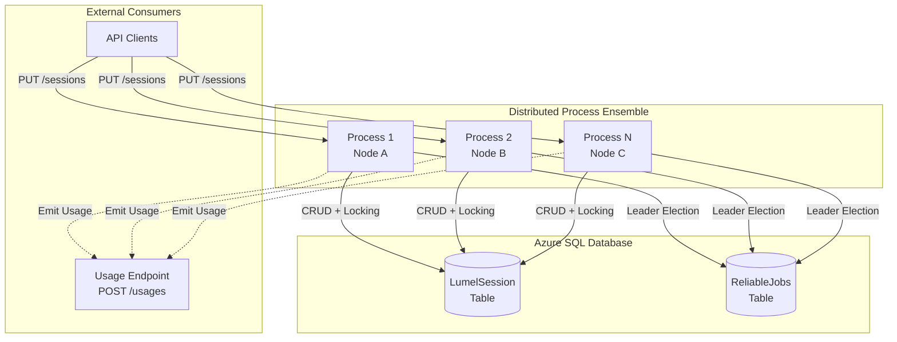

### 2.2 Core Design Principles

1. **Stateless Processes**: Each process is identical and maintains no local state about sessions
2. **SQL as Coordination Layer**: All synchronization happens via SQL Azure row-level locking
3. **Idempotency**: Repeated session creation requests yield the same result
4. **Exactly-Once Semantics**: Background jobs execute exactly once across all nodes
5. **Session Uniqueness**: One active session per (UserObjectId, CapacityId) tuple

---

## 3. Architecture Overview

### 3.1 Component Diagram

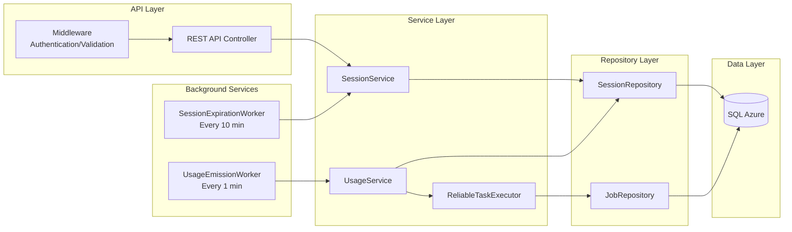

### 3.2 Process Architecture

Each process in the ensemble contains identical components:

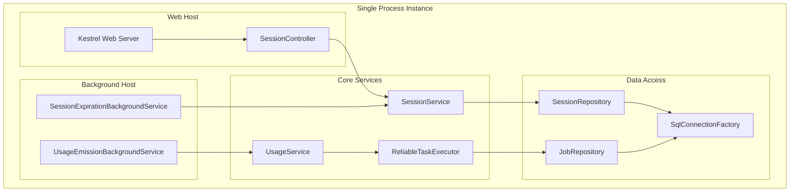

---

## 4. Data Model

### 4.1 Entity Relationship Diagram

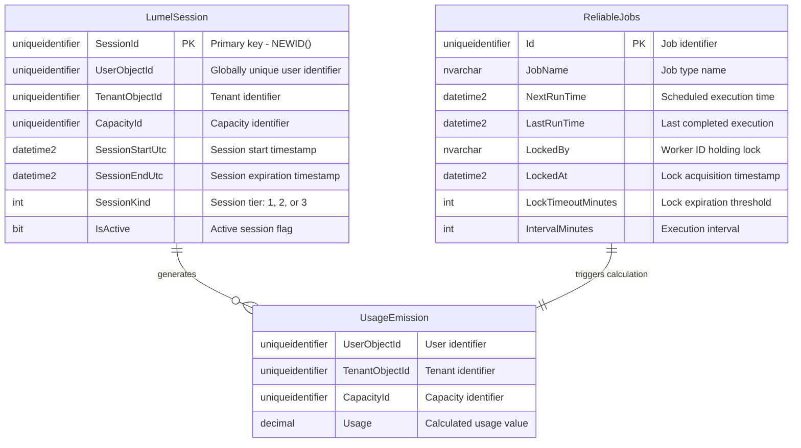

### 4.2 Session Kind Hierarchy

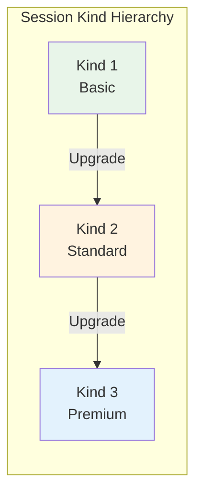

**Upgrade Rules:**
- Kind 1 → Kind 2: Allowed (triggers session recreation)
- Kind 2 → Kind 3: Allowed (triggers session recreation)
- Kind 3 → Kind 1: Not an upgrade (no-op)
- Same Kind → Same Kind: No-op

---

## 5. API Design

### 5.1 PUT /sessions Endpoint

**Request Flow Diagram:**

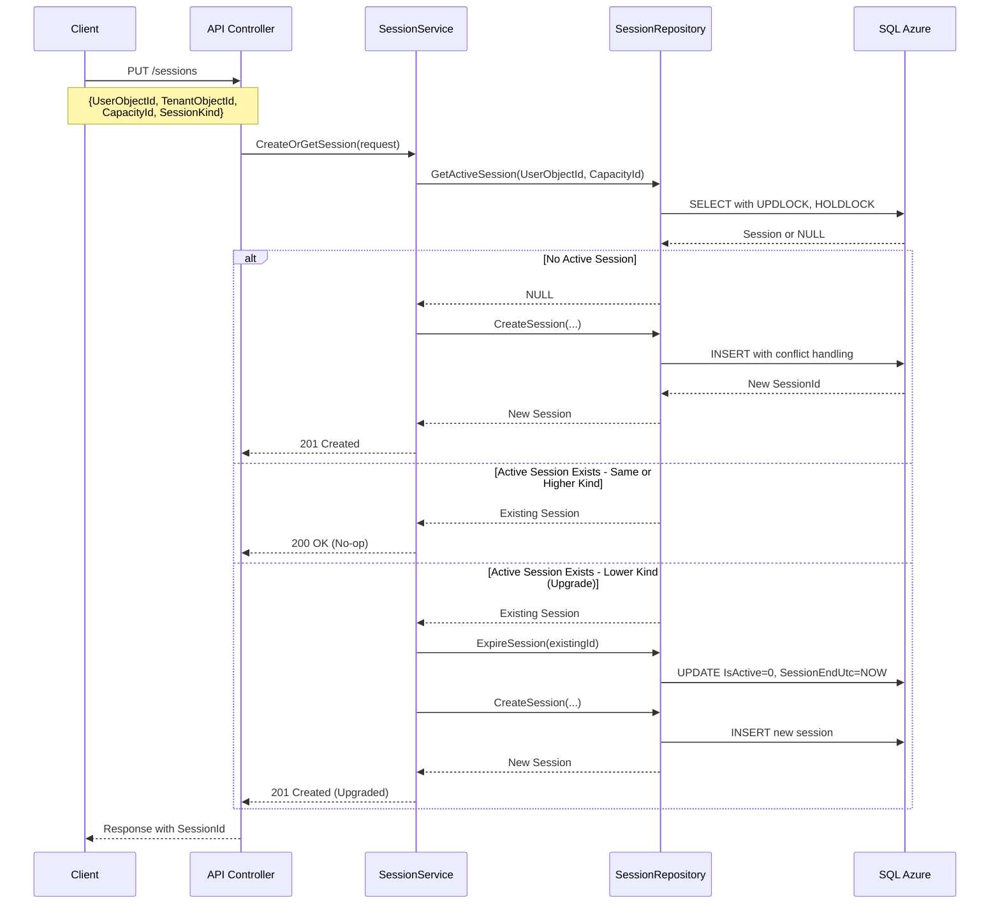

### 5.2 Request/Response Schema

**Request:**
```json
{
  "userObjectId": "guid",
  "tenantObjectId": "guid",
  "capacityId": "guid",
  "sessionKind": 1 | 2 | 3
}
```

**Response (Success):**
```json
{
  "sessionId": "guid",
  "userObjectId": "guid",
  "tenantObjectId": "guid",
  "capacityId": "guid",
  "sessionKind": 1 | 2 | 3,
  "sessionStartUtc": "2025-12-21T10:00:00Z",
  "sessionEndUtc": "2026-01-20T10:00:00Z",
  "isActive": true,
  "status": "created" | "existing" | "upgraded"
}
```

---

## 6. Session Lifecycle Management

### 6.1 Session State Machine

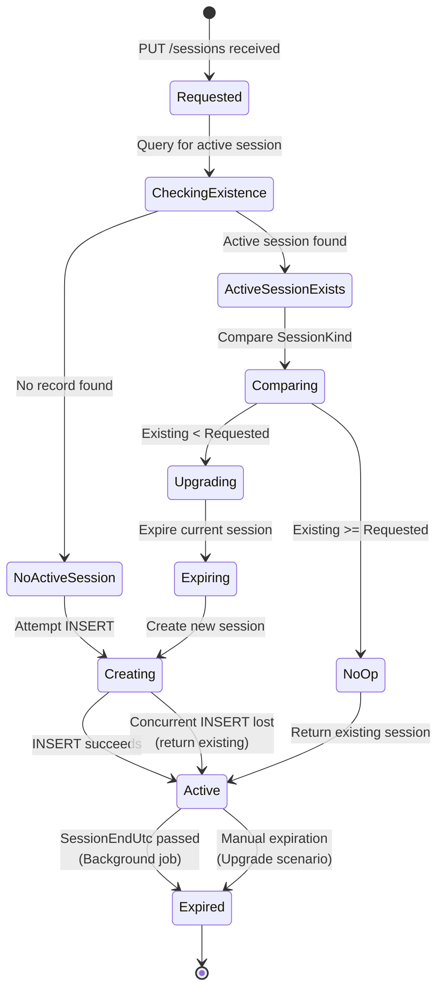

### 6.2 Session Creation Concurrency Control

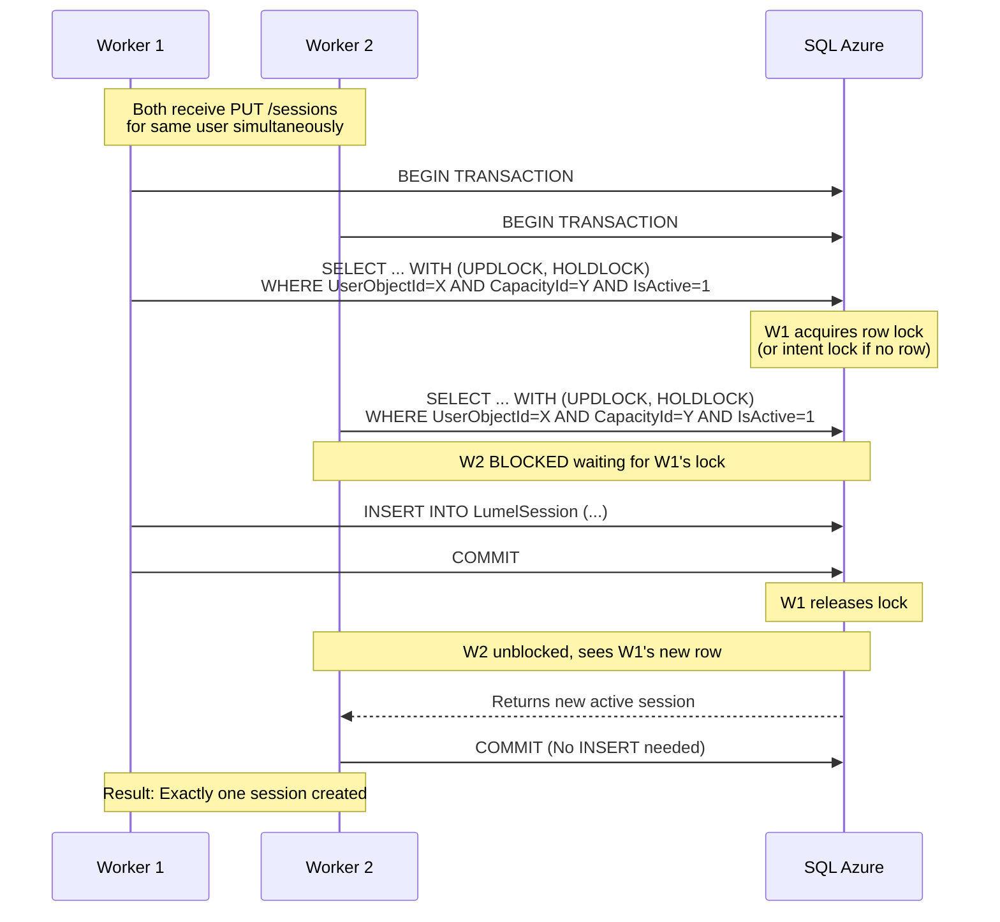

---

## 7. Background Jobs

### 7.1 Session Expiration Job (Every 10 Minutes)

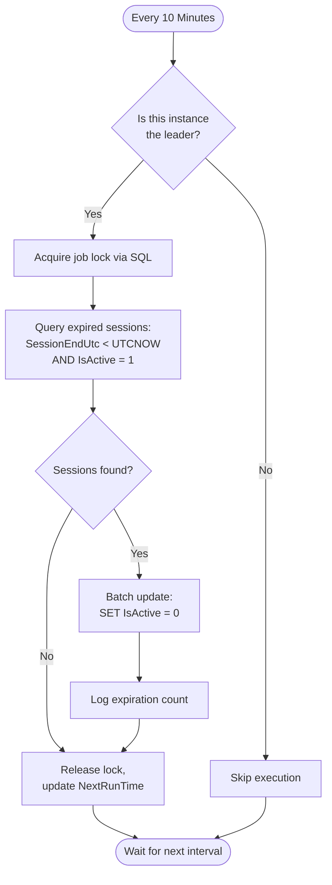

### 7.2 Usage Emission Job (Every 1 Minute)

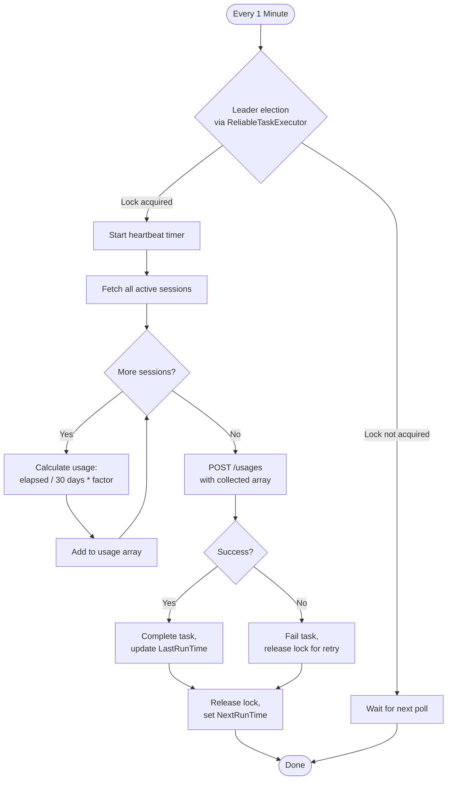

### 7.3 Usage Calculation Formula

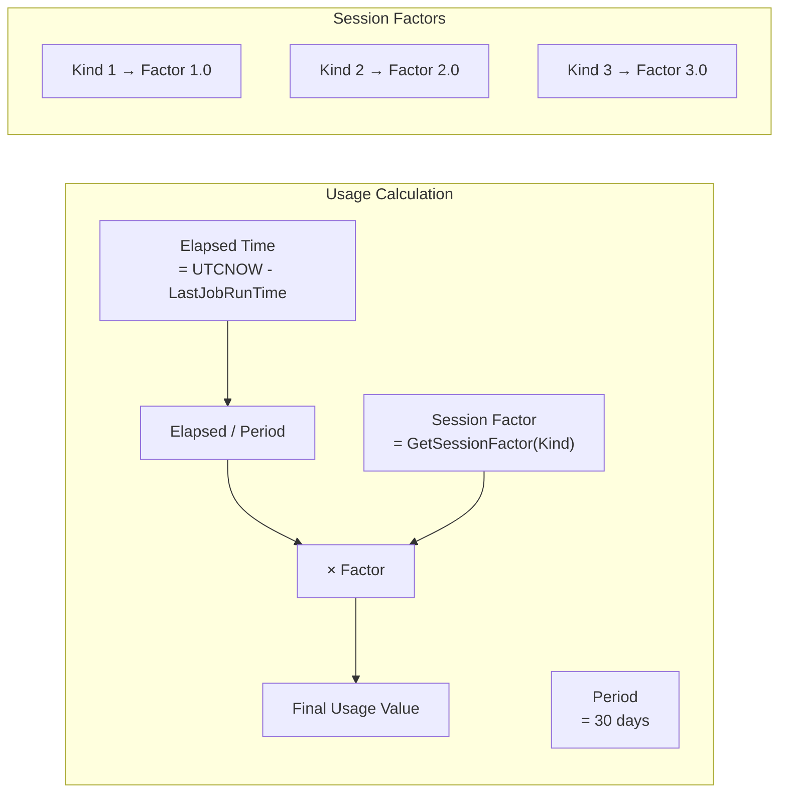

---

## 8. Reliable Task Execution Framework Integration

### 8.1 Framework Overview

The usage emission job leverages the ReliableTaskExecution framework for exactly-once execution guarantees. This framework uses SQL Azure row-level locking for leader election across distributed workers.

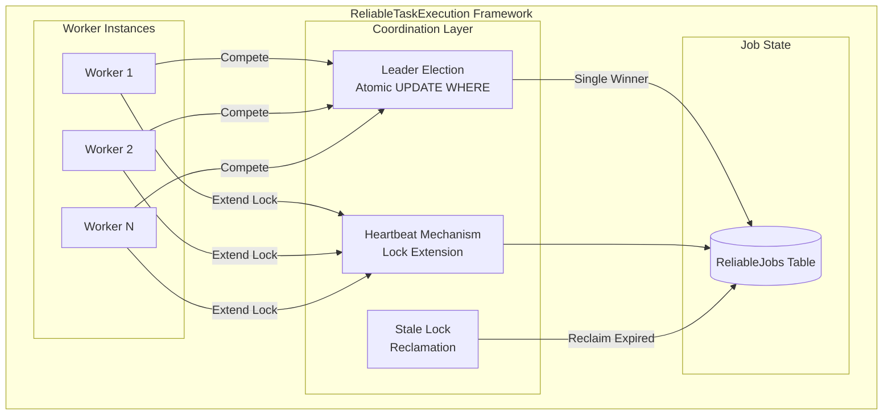

### 8.2 Leader Election Pattern

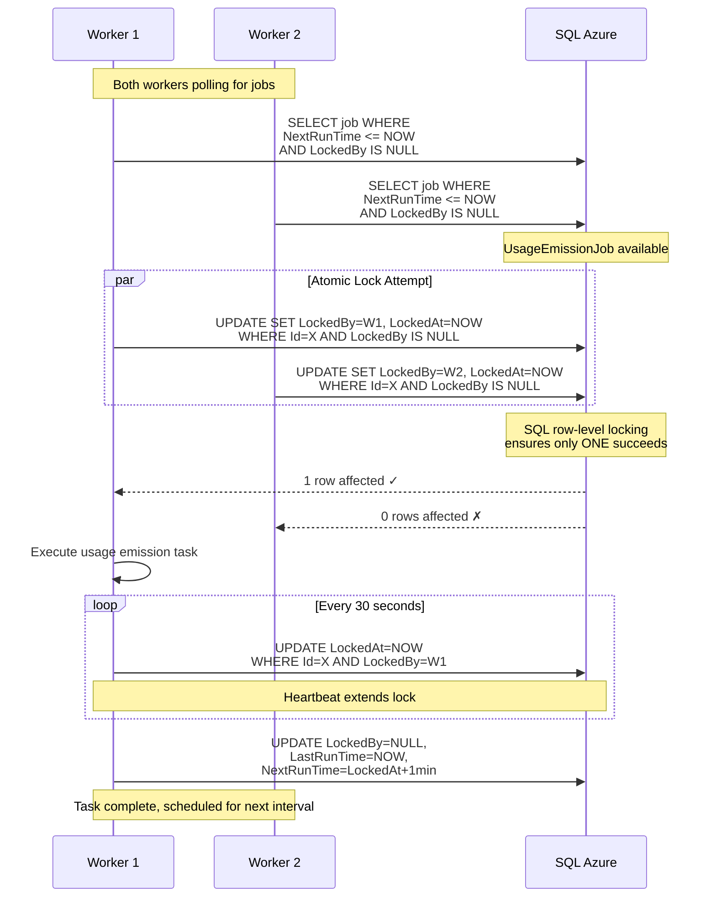

### 8.3 Crash Recovery Flow

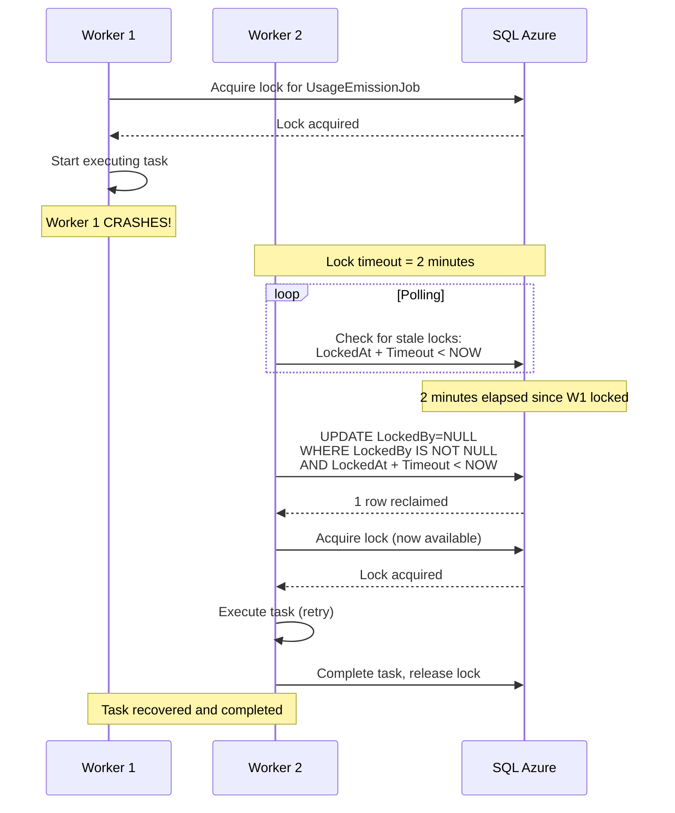

---

## 9. Detailed Pseudocode

### 9.1 SessionService - CreateOrGetSession

```
FUNCTION CreateOrGetSession(request: SessionRequest) -> SessionResponse

    // Input validation
    VALIDATE request.UserObjectId IS NOT NULL
    VALIDATE request.TenantObjectId IS NOT NULL
    VALIDATE request.CapacityId IS NOT NULL
    VALIDATE request.SessionKind IN (1, 2, 3)

    BEGIN TRANSACTION WITH SERIALIZABLE ISOLATION

    TRY
        // Step 1: Check for existing active session with row lock
        existingSession = SessionRepository.GetActiveSessionWithLock(
            userObjectId: request.UserObjectId,
            capacityId: request.CapacityId
        )
        // SQL: SELECT * FROM LumelSession WITH (UPDLOCK, HOLDLOCK)
        //      WHERE UserObjectId = @userId 
        //        AND CapacityId = @capacityId 
        //        AND IsActive = 1

        IF existingSession IS NULL THEN
            // Case A: No active session - create new one
            newSession = CreateNewSession(request)
            COMMIT TRANSACTION
            RETURN SessionResponse(newSession, status: "created")

        ELSE IF existingSession.SessionKind >= request.SessionKind THEN
            // Case B: Existing session is same or higher tier - no-op
            COMMIT TRANSACTION
            RETURN SessionResponse(existingSession, status: "existing")

        ELSE
            // Case C: Upgrade required (existing < requested)
            // Expire the current session
            SessionRepository.ExpireSession(existingSession.SessionId)
            // SQL: UPDATE LumelSession 
            //      SET IsActive = 0, SessionEndUtc = GETUTCDATE()
            //      WHERE SessionId = @sessionId

            // Create new session with upgraded kind
            newSession = CreateNewSession(request)
            COMMIT TRANSACTION
            RETURN SessionResponse(newSession, status: "upgraded")
        END IF

    CATCH Exception ex
        ROLLBACK TRANSACTION
        LOG.Error("Session creation failed", ex)
        THROW
    END TRY

END FUNCTION


FUNCTION CreateNewSession(request: SessionRequest) -> Session
    
    session = NEW Session(
        SessionId: NEWGUID(),
        UserObjectId: request.UserObjectId,
        TenantObjectId: request.TenantObjectId,
        CapacityId: request.CapacityId,
        SessionStartUtc: UTCNOW(),
        SessionEndUtc: UTCNOW() + 30 DAYS,
        SessionKind: request.SessionKind,
        IsActive: TRUE
    )
    
    SessionRepository.Insert(session)
    // SQL: INSERT INTO LumelSession (SessionId, UserObjectId, ...)
    //      VALUES (@sessionId, @userObjectId, ...)
    
    RETURN session

END FUNCTION
```

### 9.2 SessionExpirationBackgroundService

```
CLASS SessionExpirationBackgroundService EXTENDS BackgroundService

    CONSTANT INTERVAL = 10 MINUTES
    
    OVERRIDE ASYNC FUNCTION ExecuteAsync(cancellationToken: CancellationToken)
        
        WHILE NOT cancellationToken.IsCancellationRequested
            
            TRY
                expiredCount = await ExpireOverdueSessions()
                
                IF expiredCount > 0 THEN
                    LOG.Info($"Expired {expiredCount} sessions")
                END IF
                
            CATCH Exception ex
                LOG.Error("Session expiration job failed", ex)
            END TRY
            
            AWAIT Task.Delay(INTERVAL, cancellationToken)
            
        END WHILE
        
    END FUNCTION
    
    
    PRIVATE ASYNC FUNCTION ExpireOverdueSessions() -> INT
        
        // Atomic batch update - SQL engine handles concurrency
        // Multiple processes running this is safe due to WHERE clause
        
        rowsAffected = await SessionRepository.ExpireOverdueSessions()
        // SQL: UPDATE LumelSession
        //      SET IsActive = 0
        //      WHERE IsActive = 1 
        //        AND SessionEndUtc < GETUTCDATE()
        
        RETURN rowsAffected
        
    END FUNCTION

END CLASS
```

**Note on Concurrency:** The expiration job is intentionally simple and relies on SQL atomicity. Multiple processes executing `UPDATE ... WHERE IsActive = 1 AND SessionEndUtc < GETUTCDATE()` simultaneously is safe because:
1. SQL Server processes each row atomically
2. Once a row's `IsActive` is set to 0, subsequent processes won't match it in the WHERE clause
3. No duplicate work occurs - each row is expired exactly once

### 9.3 UsageEmissionBackgroundService (with ReliableTaskExecution)

```
CLASS UsageEmissionBackgroundService EXTENDS BackgroundService

    CONSTANT POLLING_INTERVAL = 60 SECONDS  // 1 minute
    CONSTANT JOB_NAME = "UsageEmissionJob"
    CONSTANT HEARTBEAT_INTERVAL = 30 SECONDS
    CONSTANT LOCK_TIMEOUT_MINUTES = 2
    
    PRIVATE workerId: STRING
    PRIVATE jobRepository: IJobRepository
    PRIVATE sessionRepository: ISessionRepository
    PRIVATE usageClient: IUsageApiClient
    
    CONSTRUCTOR(...)
        workerId = $"{MachineName}_{ProcessId}_{NewGuid()}"
    END CONSTRUCTOR
    
    
    OVERRIDE ASYNC FUNCTION ExecuteAsync(cancellationToken: CancellationToken)
        
        WHILE NOT cancellationToken.IsCancellationRequested
            
            TRY
                // Step 1: Reclaim any stale locks from crashed workers
                await jobRepository.ReclaimStaleLocks()
                
                // Step 2: Check for available job
                job = await jobRepository.GetAvailableJob(JOB_NAME)
                
                IF job IS NOT NULL AND job.NextRunTime <= UTCNOW() THEN
                    
                    // Step 3: Attempt to acquire lock (atomic)
                    lockAcquired = await jobRepository.TryAcquireLock(
                        jobId: job.Id,
                        workerId: workerId
                    )
                    
                    IF lockAcquired THEN
                        await ExecuteWithHeartbeat(job, cancellationToken)
                    END IF
                    
                END IF
                
            CATCH Exception ex
                LOG.Error("Usage emission polling failed", ex)
            END TRY
            
            AWAIT Task.Delay(POLLING_INTERVAL, cancellationToken)
            
        END WHILE
        
    END FUNCTION
    
    
    PRIVATE ASYNC FUNCTION ExecuteWithHeartbeat(job: Job, ct: CancellationToken)
        
        heartbeatCts = NEW CancellationTokenSource()
        linkedCts = CancellationTokenSource.CreateLinkedTokenSource(ct, heartbeatCts.Token)
        
        TRY
            // Start heartbeat in background
            heartbeatTask = StartHeartbeat(job.Id, heartbeatCts)
            
            // Execute the actual work
            lastRunTime = job.LastRunTime ?? job.LockedAt
            await EmitUsageForAllSessions(lastRunTime, linkedCts.Token)
            
            // Task completed successfully
            await jobRepository.CompleteTask(job.Id, job.LockedAt)
            LOG.Info("Usage emission completed successfully")
            
        CATCH OperationCanceledException
            // Cancelled due to heartbeat failure or shutdown
            await jobRepository.FailTask(job.Id)
            LOG.Warning("Usage emission cancelled")
            
        CATCH Exception ex
            // Task failed - release lock for retry
            await jobRepository.FailTask(job.Id)
            LOG.Error("Usage emission failed", ex)
            
        FINALLY
            heartbeatCts.Cancel()
        END TRY
        
    END FUNCTION
    
    
    PRIVATE ASYNC FUNCTION StartHeartbeat(jobId: GUID, cts: CancellationTokenSource)
        
        consecutiveFailures = 0
        MAX_FAILURES = 3
        
        WHILE NOT cts.Token.IsCancellationRequested
            
            AWAIT Task.Delay(HEARTBEAT_INTERVAL, cts.Token)
            
            success = await jobRepository.UpdateHeartbeat(jobId, workerId)
            
            IF success THEN
                consecutiveFailures = 0
            ELSE
                consecutiveFailures++
                LOG.Warning($"Heartbeat failed ({consecutiveFailures}/{MAX_FAILURES})")
                
                IF consecutiveFailures >= MAX_FAILURES THEN
                    LOG.Error("Abandoning job - heartbeat failures exceeded")
                    cts.Cancel()  // Cancel the main task
                    BREAK
                END IF
            END IF
            
        END WHILE
        
    END FUNCTION
    
    
    PRIVATE ASYNC FUNCTION EmitUsageForAllSessions(lastRunTime: DateTime, ct: CancellationToken)
        
        // Fetch all active sessions
        activeSessions = await sessionRepository.GetAllActiveSessions()
        
        IF activeSessions.Count == 0 THEN
            LOG.Info("No active sessions to process")
            RETURN
        END IF
        
        // Calculate usage for each session
        usageRecords = NEW List<UsageRecord>()
        
        FOR EACH session IN activeSessions
            
            ct.ThrowIfCancellationRequested()
            
            usage = CalculateUsage(session, lastRunTime)
            
            usageRecords.Add(NEW UsageRecord(
                UserObjectId: session.UserObjectId,
                TenantObjectId: session.TenantObjectId,
                CapacityId: session.CapacityId,
                Usage: usage
            ))
            
        END FOR
        
        // Emit all usage records in single API call
        await usageClient.PostUsages(usageRecords)
        LOG.Info($"Emitted usage for {usageRecords.Count} sessions")
        
    END FUNCTION
    
    
    PRIVATE FUNCTION CalculateUsage(session: Session, lastRunTime: DateTime) -> DECIMAL
        
        // Usage = (elapsed time / 30 days) * session factor
        
        elapsedTime = UTCNOW() - lastRunTime
        periodDays = 30.0
        
        factor = GetSessionFactor(session.SessionKind)
        
        usage = (elapsedTime.TotalDays / periodDays) * factor
        
        RETURN ROUND(usage, 6)
        
    END FUNCTION
    
    
    PRIVATE FUNCTION GetSessionFactor(sessionKind: INT) -> DECIMAL
        
        SWITCH sessionKind
            CASE 1: RETURN 1.0   // Basic tier
            CASE 2: RETURN 2.0   // Standard tier
            CASE 3: RETURN 3.0   // Premium tier
            DEFAULT: THROW InvalidOperationException($"Unknown session kind: {sessionKind}")
        END SWITCH
        
    END FUNCTION

END CLASS
```

### 9.4 SessionRepository - Key Operations

```
CLASS SessionRepository

    PRIVATE connectionFactory: ISqlConnectionFactory
    
    
    ASYNC FUNCTION GetActiveSessionWithLock(
        userObjectId: GUID, 
        capacityId: GUID
    ) -> Session?
        
        sql = "
            SELECT SessionId, UserObjectId, TenantObjectId, CapacityId,
                   SessionStartUtc, SessionEndUtc, SessionKind, IsActive
            FROM LumelSession WITH (UPDLOCK, HOLDLOCK)
            WHERE UserObjectId = @UserObjectId
              AND CapacityId = @CapacityId
              AND IsActive = 1
        "
        
        using connection = await connectionFactory.CreateConnectionAsync()
        using command = NEW SqlCommand(sql, connection)
        
        command.Parameters.AddWithValue("@UserObjectId", userObjectId)
        command.Parameters.AddWithValue("@CapacityId", capacityId)
        
        using reader = await command.ExecuteReaderAsync()
        
        IF await reader.ReadAsync() THEN
            RETURN MapToSession(reader)
        ELSE
            RETURN NULL
        END IF
        
    END FUNCTION
    
    
    ASYNC FUNCTION Insert(session: Session) -> VOID
        
        sql = "
            INSERT INTO LumelSession 
                (SessionId, UserObjectId, TenantObjectId, CapacityId,
                 SessionStartUtc, SessionEndUtc, SessionKind, IsActive)
            VALUES 
                (@SessionId, @UserObjectId, @TenantObjectId, @CapacityId,
                 @SessionStartUtc, @SessionEndUtc, @SessionKind, @IsActive)
        "
        
        using connection = await connectionFactory.CreateConnectionAsync()
        using command = NEW SqlCommand(sql, connection)
        
        command.Parameters.AddWithValue("@SessionId", session.SessionId)
        command.Parameters.AddWithValue("@UserObjectId", session.UserObjectId)
        command.Parameters.AddWithValue("@TenantObjectId", session.TenantObjectId)
        command.Parameters.AddWithValue("@CapacityId", session.CapacityId)
        command.Parameters.AddWithValue("@SessionStartUtc", session.SessionStartUtc)
        command.Parameters.AddWithValue("@SessionEndUtc", session.SessionEndUtc)
        command.Parameters.AddWithValue("@SessionKind", session.SessionKind)
        command.Parameters.AddWithValue("@IsActive", session.IsActive)
        
        await command.ExecuteNonQueryAsync()
        
    END FUNCTION
    
    
    ASYNC FUNCTION ExpireSession(sessionId: GUID) -> VOID
        
        sql = "
            UPDATE LumelSession
            SET IsActive = 0,
                SessionEndUtc = GETUTCDATE()
            WHERE SessionId = @SessionId
        "
        
        using connection = await connectionFactory.CreateConnectionAsync()
        using command = NEW SqlCommand(sql, connection)
        
        command.Parameters.AddWithValue("@SessionId", sessionId)
        
        await command.ExecuteNonQueryAsync()
        
    END FUNCTION
    
    
    ASYNC FUNCTION ExpireOverdueSessions() -> INT
        
        sql = "
            UPDATE LumelSession
            SET IsActive = 0
            WHERE IsActive = 1
              AND SessionEndUtc < GETUTCDATE()
        "
        
        using connection = await connectionFactory.CreateConnectionAsync()
        using command = NEW SqlCommand(sql, connection)
        
        rowsAffected = await command.ExecuteNonQueryAsync()
        
        RETURN rowsAffected
        
    END FUNCTION
    
    
    ASYNC FUNCTION GetAllActiveSessions() -> List<Session>
        
        sql = "
            SELECT SessionId, UserObjectId, TenantObjectId, CapacityId,
                   SessionStartUtc, SessionEndUtc, SessionKind, IsActive
            FROM LumelSession
            WHERE IsActive = 1
        "
        
        sessions = NEW List<Session>()
        
        using connection = await connectionFactory.CreateConnectionAsync()
        using command = NEW SqlCommand(sql, connection)
        using reader = await command.ExecuteReaderAsync()
        
        WHILE await reader.ReadAsync()
            sessions.Add(MapToSession(reader))
        END WHILE
        
        RETURN sessions
        
    END FUNCTION

END CLASS
```

### 9.5 JobRepository - Reliable Task Execution

```
CLASS JobRepository

    PRIVATE connectionFactory: ISqlConnectionFactory
    
    
    ASYNC FUNCTION GetAvailableJob(jobName: STRING) -> Job?
        
        sql = "
            SELECT Id, JobName, NextRunTime, LastRunTime, 
                   LockedBy, LockedAt, LockTimeoutMinutes, IntervalMinutes
            FROM ReliableJobs
            WHERE JobName = @JobName
              AND LockedBy IS NULL
              AND NextRunTime <= GETUTCDATE()
        "
        
        using connection = await connectionFactory.CreateConnectionAsync()
        using command = NEW SqlCommand(sql, connection)
        
        command.Parameters.AddWithValue("@JobName", jobName)
        
        using reader = await command.ExecuteReaderAsync()
        
        IF await reader.ReadAsync() THEN
            RETURN MapToJob(reader)
        ELSE
            RETURN NULL
        END IF
        
    END FUNCTION
    
    
    ASYNC FUNCTION TryAcquireLock(jobId: GUID, workerId: STRING) -> BOOL
        
        // Atomic UPDATE WHERE pattern - only one worker succeeds
        sql = "
            UPDATE ReliableJobs
            SET LockedBy = @WorkerId,
                LockedAt = GETUTCDATE()
            WHERE Id = @JobId
              AND LockedBy IS NULL
        "
        
        using connection = await connectionFactory.CreateConnectionAsync()
        using command = NEW SqlCommand(sql, connection)
        
        command.Parameters.AddWithValue("@JobId", jobId)
        command.Parameters.AddWithValue("@WorkerId", workerId)
        
        rowsAffected = await command.ExecuteNonQueryAsync()
        
        // Only one worker's UPDATE will affect 1 row
        RETURN rowsAffected == 1
        
    END FUNCTION
    
    
    ASYNC FUNCTION UpdateHeartbeat(jobId: GUID, workerId: STRING) -> BOOL
        
        sql = "
            UPDATE ReliableJobs
            SET LockedAt = GETUTCDATE()
            WHERE Id = @JobId
              AND LockedBy = @WorkerId
        "
        
        using connection = await connectionFactory.CreateConnectionAsync()
        using command = NEW SqlCommand(sql, connection)
        
        command.Parameters.AddWithValue("@JobId", jobId)
        command.Parameters.AddWithValue("@WorkerId", workerId)
        
        rowsAffected = await command.ExecuteNonQueryAsync()
        
        RETURN rowsAffected == 1
        
    END FUNCTION
    
    
    ASYNC FUNCTION CompleteTask(jobId: GUID, lockedAt: DateTime) -> VOID
        
        // NextRunTime calculated from LockedAt to prevent timing drift
        sql = "
            UPDATE ReliableJobs
            SET LockedBy = NULL,
                LockedAt = NULL,
                LastRunTime = GETUTCDATE(),
                NextRunTime = DATEADD(MINUTE, IntervalMinutes, @LockedAt)
            WHERE Id = @JobId
        "
        
        using connection = await connectionFactory.CreateConnectionAsync()
        using command = NEW SqlCommand(sql, connection)
        
        command.Parameters.AddWithValue("@JobId", jobId)
        command.Parameters.AddWithValue("@LockedAt", lockedAt)
        
        await command.ExecuteNonQueryAsync()
        
    END FUNCTION
    
    
    ASYNC FUNCTION FailTask(jobId: GUID) -> VOID
        
        // Release lock but preserve NextRunTime for quick retry
        sql = "
            UPDATE ReliableJobs
            SET LockedBy = NULL,
                LockedAt = NULL
            WHERE Id = @JobId
        "
        
        using connection = await connectionFactory.CreateConnectionAsync()
        using command = NEW SqlCommand(sql, connection)
        
        command.Parameters.AddWithValue("@JobId", jobId)
        
        await command.ExecuteNonQueryAsync()
        
    END FUNCTION
    
    
    ASYNC FUNCTION ReclaimStaleLocks() -> INT
        
        // Reclaim locks from crashed workers
        sql = "
            UPDATE ReliableJobs
            SET LockedBy = NULL,
                LockedAt = NULL
            WHERE LockedBy IS NOT NULL
              AND DATEADD(MINUTE, LockTimeoutMinutes, LockedAt) < GETUTCDATE()
        "
        
        using connection = await connectionFactory.CreateConnectionAsync()
        using command = NEW SqlCommand(sql, connection)
        
        rowsAffected = await command.ExecuteNonQueryAsync()
        
        IF rowsAffected > 0 THEN
            LOG.Warning($"Reclaimed {rowsAffected} stale job lock(s)")
        END IF
        
        RETURN rowsAffected
        
    END FUNCTION

END CLASS
```

---

## 10. SQL Implementation

### 10.1 Table Creation Scripts

```sql
-- =====================================================
-- LumelSession Table
-- =====================================================
-- Purpose: Stores user session records with lifecycle tracking
-- Key constraint: One active session per (UserObjectId, CapacityId)

CREATE TABLE dbo.LumelSession
(
    SessionId           UNIQUEIDENTIFIER    NOT NULL    DEFAULT NEWID(),
    UserObjectId        UNIQUEIDENTIFIER    NOT NULL,
    TenantObjectId      UNIQUEIDENTIFIER    NOT NULL,
    CapacityId          UNIQUEIDENTIFIER    NOT NULL,
    SessionStartUtc     DATETIME2(3)        NOT NULL,
    SessionEndUtc       DATETIME2(3)        NOT NULL,
    SessionKind         INT                 NOT NULL,
    IsActive            BIT                 NOT NULL    DEFAULT 1,
    
    -- Primary Key
    CONSTRAINT PK_LumelSession PRIMARY KEY CLUSTERED (SessionId),
    
    -- Session kind must be valid
    CONSTRAINT CK_LumelSession_SessionKind CHECK (SessionKind IN (1, 2, 3)),
    
    -- Session end must be after start
    CONSTRAINT CK_LumelSession_SessionDates CHECK (SessionEndUtc > SessionStartUtc)
);
GO

-- Index for session lookup by user and capacity (most common query)
-- Filtered to only active sessions for efficiency
CREATE UNIQUE NONCLUSTERED INDEX IX_LumelSession_UserCapacity_Active
ON dbo.LumelSession (UserObjectId, CapacityId)
WHERE IsActive = 1;
GO

-- Index for expiration job (find expired active sessions)
CREATE NONCLUSTERED INDEX IX_LumelSession_Expiration
ON dbo.LumelSession (SessionEndUtc, IsActive)
WHERE IsActive = 1;
GO

-- Index for usage emission (all active sessions)
CREATE NONCLUSTERED INDEX IX_LumelSession_Active
ON dbo.LumelSession (IsActive)
INCLUDE (UserObjectId, TenantObjectId, CapacityId, SessionKind)
WHERE IsActive = 1;
GO
```

```sql
-- =====================================================
-- ReliableJobs Table
-- =====================================================
-- Purpose: Coordinates exactly-once job execution across distributed workers
-- Uses row-level locking for leader election

CREATE TABLE dbo.ReliableJobs
(
    Id                  UNIQUEIDENTIFIER    NOT NULL    DEFAULT NEWID(),
    JobName             NVARCHAR(256)       NOT NULL,
    NextRunTime         DATETIME2(3)        NOT NULL,
    LastRunTime         DATETIME2(3)        NULL,
    LockedBy            NVARCHAR(256)       NULL,
    LockedAt            DATETIME2(3)        NULL,
    LockTimeoutMinutes  INT                 NOT NULL    DEFAULT 2,
    IntervalMinutes     INT                 NOT NULL    DEFAULT 1,
    
    -- Primary Key
    CONSTRAINT PK_ReliableJobs PRIMARY KEY CLUSTERED (Id),
    
    -- Job names should be unique
    CONSTRAINT UQ_ReliableJobs_JobName UNIQUE (JobName),
    
    -- Lock timeout must be positive
    CONSTRAINT CK_ReliableJobs_LockTimeout CHECK (LockTimeoutMinutes > 0),
    
    -- Interval must be positive
    CONSTRAINT CK_ReliableJobs_Interval CHECK (IntervalMinutes > 0)
);
GO

-- Index for job polling (find unlocked jobs ready to run)
CREATE NONCLUSTERED INDEX IX_ReliableJobs_Polling
ON dbo.ReliableJobs (NextRunTime, LockedBy)
WHERE LockedBy IS NULL;
GO

-- Index for stale lock detection
CREATE NONCLUSTERED INDEX IX_ReliableJobs_StaleLocks
ON dbo.ReliableJobs (LockedAt, LockTimeoutMinutes)
WHERE LockedBy IS NOT NULL;
GO
```

### 10.2 Seed Data

```sql
-- =====================================================
-- Seed ReliableJobs with Usage Emission Job
-- =====================================================

INSERT INTO dbo.ReliableJobs 
    (Id, JobName, NextRunTime, LastRunTime, LockedBy, LockedAt, LockTimeoutMinutes, IntervalMinutes)
VALUES 
    (NEWID(), 
     'UsageEmissionJob', 
     GETUTCDATE(),           -- Ready to run immediately
     NULL,                   -- Never run before
     NULL,                   -- Not locked
     NULL,                   -- No lock timestamp
     2,                      -- 2 minute lock timeout
     1);                     -- Run every 1 minute
GO
```

### 10.3 Key SQL Patterns

```sql
-- =====================================================
-- Pattern: Idempotent Session Creation with Row Lock
-- =====================================================
-- This pattern ensures exactly one session is created
-- even when multiple requests arrive simultaneously

BEGIN TRANSACTION;

-- Step 1: Acquire exclusive lock on any existing active session
SELECT SessionId, SessionKind
FROM dbo.LumelSession WITH (UPDLOCK, HOLDLOCK)
WHERE UserObjectId = @UserObjectId
  AND CapacityId = @CapacityId
  AND IsActive = 1;

-- Step 2: Based on result, either:
--   a) INSERT new session if none exists
--   b) Do nothing if existing session is same/higher kind
--   c) Expire existing + INSERT new if upgrading

COMMIT TRANSACTION;
```

```sql
-- =====================================================
-- Pattern: Atomic Leader Election
-- =====================================================
-- Only one worker can successfully acquire the lock
-- because UPDATE is atomic at row level

UPDATE dbo.ReliableJobs
SET LockedBy = @WorkerId,
    LockedAt = GETUTCDATE()
WHERE Id = @JobId
  AND LockedBy IS NULL;

-- Check @@ROWCOUNT = 1 for success
-- If 0, another worker acquired the lock first
```

```sql
-- =====================================================
-- Pattern: Heartbeat Extension
-- =====================================================
-- Worker extends its lock by updating LockedAt
-- If update fails (0 rows), lock was stolen/expired

UPDATE dbo.ReliableJobs
SET LockedAt = GETUTCDATE()
WHERE Id = @JobId
  AND LockedBy = @WorkerId;

-- @@ROWCOUNT = 0 means lock lost, abandon task
```

```sql
-- =====================================================
-- Pattern: Stale Lock Reclamation
-- =====================================================
-- Crashed workers leave orphaned locks
-- Other workers reclaim them after timeout

UPDATE dbo.ReliableJobs
SET LockedBy = NULL,
    LockedAt = NULL
WHERE LockedBy IS NOT NULL
  AND DATEADD(MINUTE, LockTimeoutMinutes, LockedAt) < GETUTCDATE();
```

```sql
-- =====================================================
-- Pattern: Timing Drift Prevention
-- =====================================================
-- NextRunTime calculated from task START (LockedAt), not completion
-- This ensures consistent intervals regardless of task duration

UPDATE dbo.ReliableJobs
SET LockedBy = NULL,
    LockedAt = NULL,
    LastRunTime = GETUTCDATE(),
    NextRunTime = DATEADD(MINUTE, IntervalMinutes, @LockedAt)  -- From start time!
WHERE Id = @JobId;
```

```sql
-- =====================================================
-- Pattern: Batch Session Expiration
-- =====================================================
-- Safe for concurrent execution - each row updated only once

UPDATE dbo.LumelSession
SET IsActive = 0
WHERE IsActive = 1
  AND SessionEndUtc < GETUTCDATE();
```

---

## 11. Deployment Considerations

### 11.1 Deployment Architecture

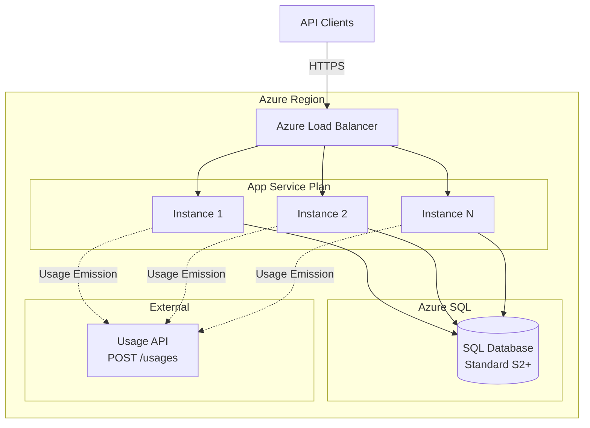

### 11.2 Scaling Considerations

| Aspect | Recommendation |
|--------|----------------|
| **Horizontal Scaling** | Add instances freely - SQL coordination handles concurrency |
| **Database Tier** | Start with S2, scale based on DTU usage |
| **Connection Pooling** | Enable with max 100 connections per instance |
| **Session Table Growth** | Partition by SessionStartUtc for large deployments |
| **Usage Emission** | Single job instance via leader election - inherently limited |

### 11.3 Monitoring Recommendations

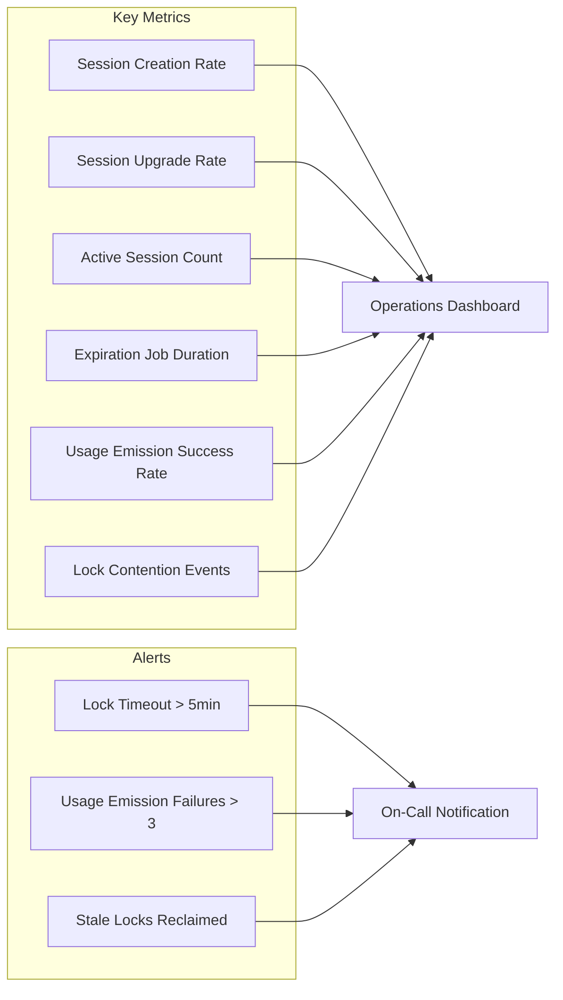

---

## 12. Appendix: MermaidJS Diagrams Reference

This document contains the following diagrams:

1. **High-Level Architecture** (Section 2.1) - System overview with all components
2. **Component Diagram** (Section 3.1) - Internal service architecture
3. **Process Architecture** (Section 3.2) - Single process internals
4. **Entity Relationship Diagram** (Section 4.1) - Data model
5. **Session Kind Hierarchy** (Section 4.2) - Upgrade flow visualization
6. **Request Flow Diagram** (Section 5.1) - PUT /sessions sequence
7. **Session State Machine** (Section 6.1) - Lifecycle states
8. **Concurrency Control Sequence** (Section 6.2) - Lock behavior
9. **Session Expiration Flow** (Section 7.1) - Background job flow
10. **Usage Emission Flow** (Section 7.2) - Complex job flow
11. **Usage Calculation** (Section 7.3) - Formula visualization
12. **ReliableTaskExecution Framework** (Section 8.1) - Framework overview
13. **Leader Election Sequence** (Section 8.2) - Lock acquisition
14. **Crash Recovery Sequence** (Section 8.3) - Failover behavior
15. **Deployment Architecture** (Section 11.1) - Azure deployment
16. **Monitoring Metrics** (Section 11.3) - Observability

---

*Document generated for Lumel Session Management System v1.0*
