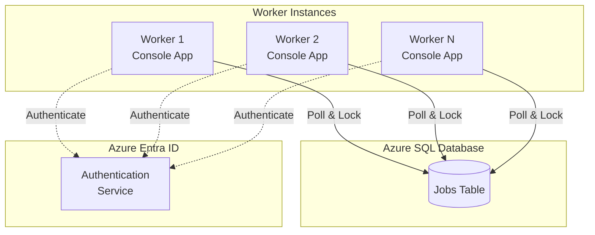
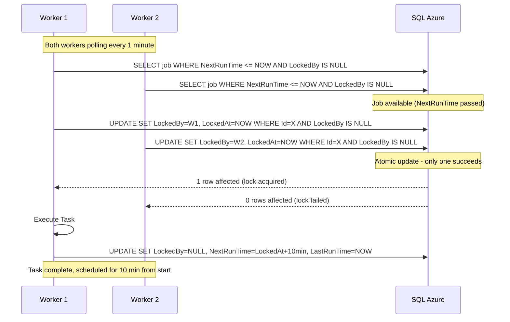
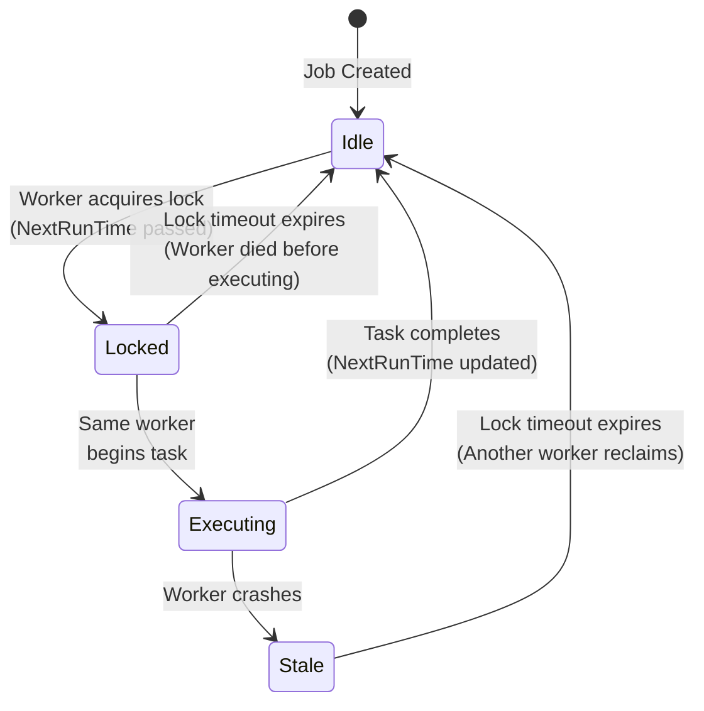
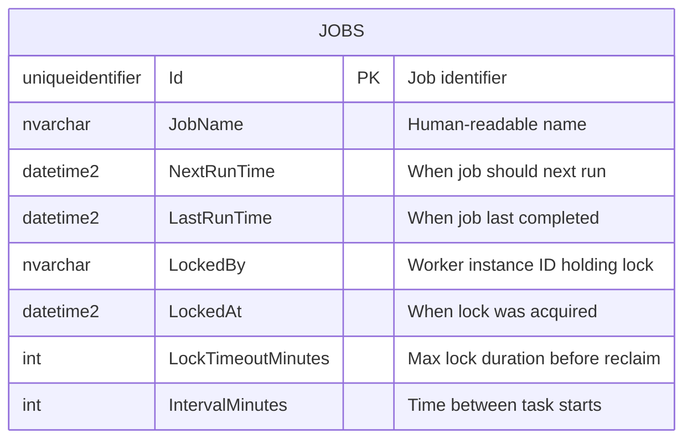

# Product Mission

## Pitch

**ReliableTaskExecution** is a proof-of-concept distributed task execution system that helps developers understand and implement exactly-once task execution across multiple worker instances by providing a minimal, production-ready pattern using SQL Azure for coordination and leader election.

## Users

### Primary Customers
- **Backend Developers**: Engineers exploring distributed systems patterns for scheduled task execution
- **Solution Architects**: Technical leads evaluating coordination mechanisms for multi-instance deployments
- **DevOps Engineers**: Practitioners needing reliable, fault-tolerant background job patterns

### User Personas

**Alex the Backend Developer** (28-40)
- **Role:** Senior Software Engineer at a mid-sized company
- **Context:** Building a system that requires periodic background tasks across multiple app instances
- **Pain Points:** Existing solutions (Hangfire, Quartz.NET) feel heavy for simple use cases; unclear how to implement exactly-once semantics
- **Goals:** Understand the fundamental patterns; have working code to adapt for production

**Sam the Architect** (35-50)
- **Role:** Technical Architect evaluating infrastructure patterns
- **Context:** Designing a cloud-native system on Azure with multiple worker instances
- **Pain Points:** Needs to prove a concept before committing to a full framework; wants minimal dependencies
- **Goals:** Validate the approach with stakeholders; understand failure modes and recovery

## The Problem

### The Exactly-Once Execution Challenge

When running scheduled tasks across multiple application instances, three critical problems emerge:

1. **Duplicate Execution**: Without coordination, all instances may execute the same task simultaneously, causing data corruption, duplicate notifications, or wasted resources.

2. **Missed Execution**: If the "active" instance crashes, tasks may never run because no failover mechanism exists.

3. **Timing Drift**: Naive implementations that schedule "10 minutes from completion" gradually drift from the intended schedule; tasks should run at predictable intervals from their start time.

**Quantifiable Impact**: Duplicate task execution can result in duplicate billing charges, multiple email notifications to users, or corrupted aggregate data. Missed executions can cause SLA violations and delayed business processes.

**Our Solution**: A lightweight coordination pattern using SQL Azure row-level locking for leader election, ensuring exactly one worker executes each task, with automatic failover when workers crash or tasks fail.

## Differentiators

### Minimal Dependencies
Unlike Hangfire, Quartz.NET, or Azure Durable Functions, this PoC uses only a SQL Azure database you already have. No additional infrastructure, no message queues, no Redis cache required.
This results in faster implementation, lower costs, and fewer operational concerns.

### Transparent Mechanics
Unlike black-box scheduling frameworks, every line of coordination logic is visible and understandable. The entire pattern fits in a single console application.
This results in confident production deployments because you understand exactly how it works.

### Cloud-Native Authentication
Unlike solutions requiring connection strings with passwords, this PoC uses Entra ID (Azure AD) authentication for SQL Azure access.
This results in improved security posture and compliance with modern Azure best practices.

## Key Features

### Core Features
- **Leader Election via SQL Locking**: Atomic row-level updates ensure only one worker claims each task, eliminating race conditions
- **Configurable Polling Interval**: Workers check for available tasks at a configurable interval (default: 1 minute)
- **Configurable Task Interval**: Tasks reschedule based on configurable intervals (default: 10 minutes from task start)

### Reliability Features
- **Crash Recovery**: If a worker crashes mid-task, the task's "locked" state times out and another worker picks it up
- **Failure Handling**: Failed tasks are automatically released for retry by other workers
- **Heartbeat Mechanism**: Workers update timestamps to prove liveness; stale locks are reclaimed

### Developer Experience Features
- **Manual SQL Scripts**: Clear, documented SQL for table creation and job seeding - no EF migrations or ORM complexity
- **Architectural Diagrams**: MermaidJS diagrams explaining the coordination flow
- **Complete Specifications**: Detailed documentation of the algorithm and failure scenarios

## Architecture Overview

### System Components

### Worker Coordination Flow

### Task State Machine

### Database Schema

## Success Criteria

1. **Exactly-Once Execution**: Running 3+ workers simultaneously, each task executes exactly once per scheduled interval
2. **Crash Recovery**: Killing a worker mid-task results in another worker completing the task within the lock timeout period
3. **Predictable Scheduling**: Tasks run at consistent intervals from their start time, not completion time
4. **Zero External Dependencies**: Only SQL Azure required beyond the console application itself
